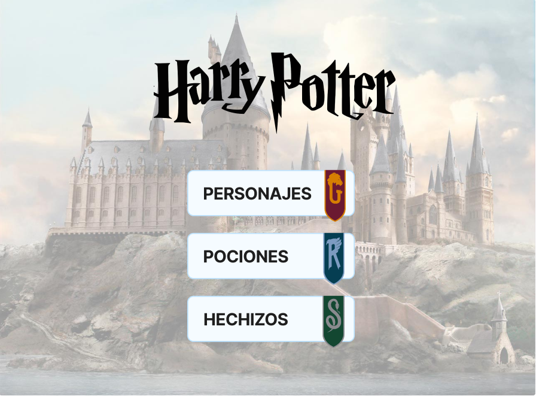
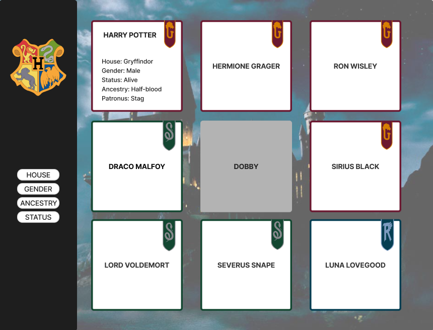

# Data Lovers - Harry Potter

***

## 1. Definición del producto

* ¿Quiénes son los principales usuarios de producto?

    R// Personas que sean fans de harry potter.

* ¿Cuáles son los objetivos de estos usuarios en relación con el producto?

    R// Tener donde encontrar información detallada sobre la Saga de Harry Potter.

* ¿Cuáles son los datos más relevantes que quieren ver en la interfaz y por qué?

    R// Información sobre los personajes como: Nombre, casa, género, ancestros, fecha de muerte, varita mágica. 
        Porque es lo que más llama la atención en cuanto a la saga.

* ¿Cuándo utilizan o utilizarían el producto?

    R//   Cuando quieres información precisa y curiosa sobre los personajes.

***

### 2. Historias de Usuario

**A. Primer historia**

Yo como: Fan de Harry Potter
Quiero: Tener acceso a información de los personajes de la saga
Para: Conocer más a detalle mis personajes favoritos

***Criterios de aceptación***

Dado que quiero conocer más a detalle mis personajes favoritos, 
puedo buscarlos y distinguirlos mejor por el color/bandera de la casa, 
y tener acceso a la información sobre cada uno

**B. Segunda historia**

Yo como: Fan de las películas de Harry Potter
Quiero: Conocer todas las producciones de series o películas relacionadas
Para: Estar informado de los próximos estrenos

***Criterios de aceptación***

Dado que quiero conocer los próximos estrenos y producciones, 
puedo encontrar en orden de publicación las películas y series y próximos estrenos

**C. Tercer historia**

Yo como: Persona curiosa en Harry Potter
Quiero: Conocer conocer más sobre Harry Potter y datos curiosos
Para: Tener datos curiosos para hablar con amigos 

***Criterios de aceptación***

Dado que quiero conocer más sobre Harry Potter, 
puedo encontrar información variada pero a la vez especifica sobre personajes, 
hechizos y pociones de la serie

***

#### 2. Prototipo

##### 2. Tests de usabilidad

Realizamos nuestro test de usabilidad a cuatro personas y encontramos lo siguiente:

* La interfaz es amigable y de facil interacción con el usuario.
* El usuario se relaciono bien con los botones de filtrado.
* Se entendio el proposito de los botones de filtrado.